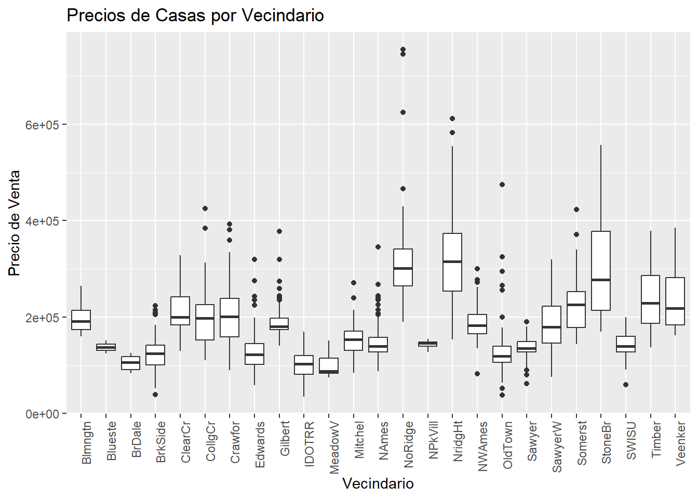
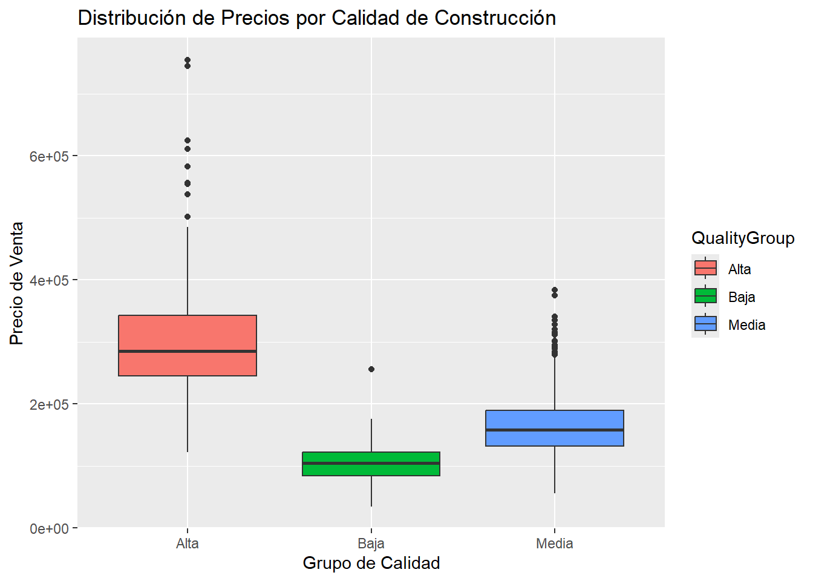
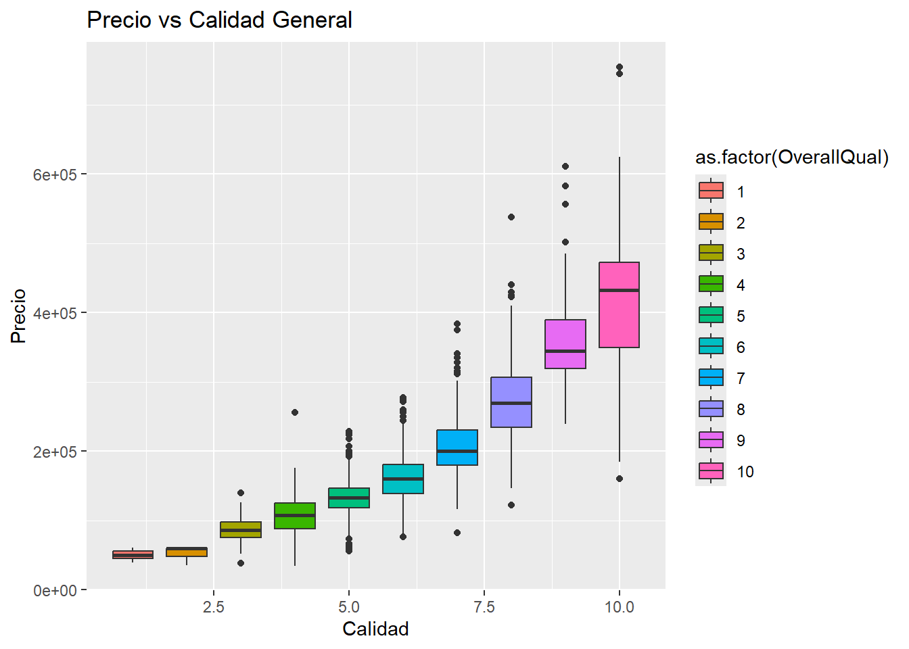
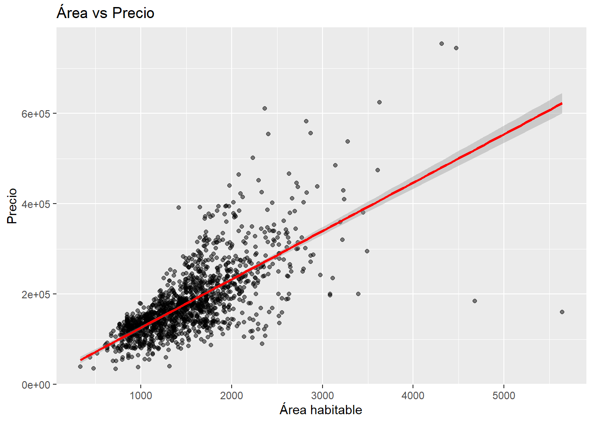
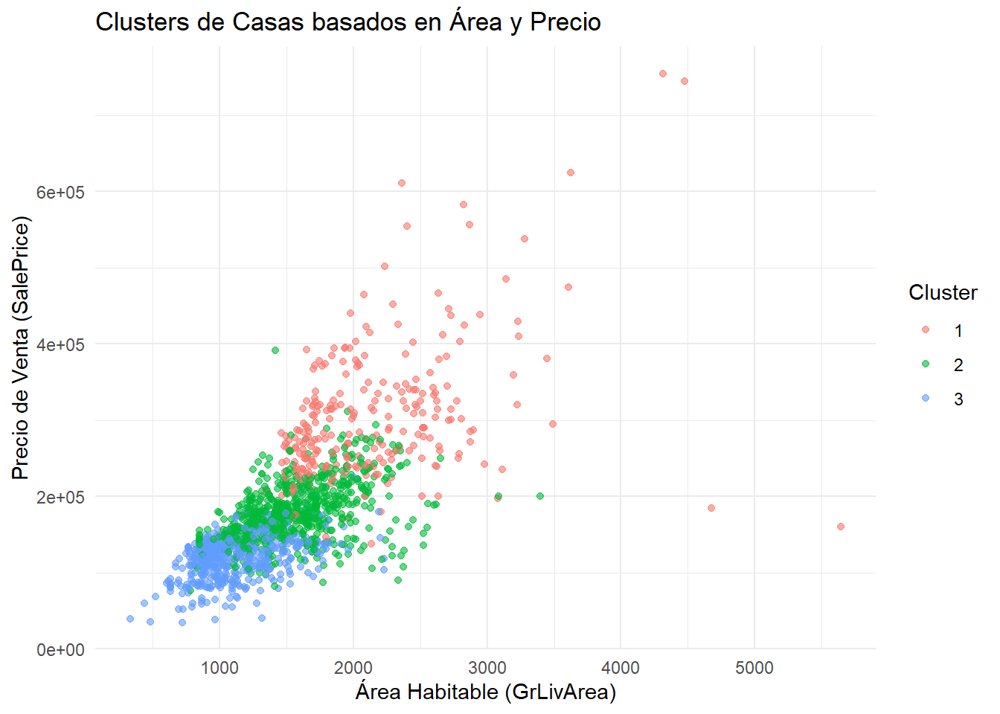
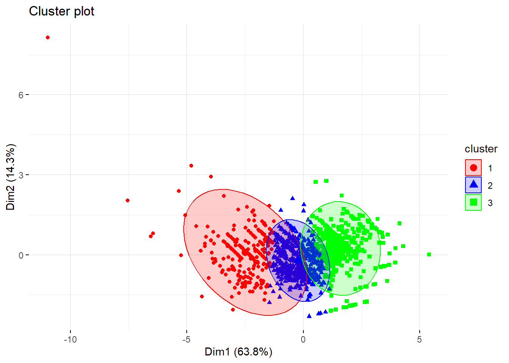
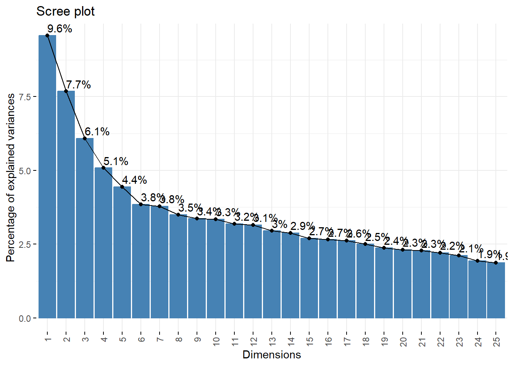
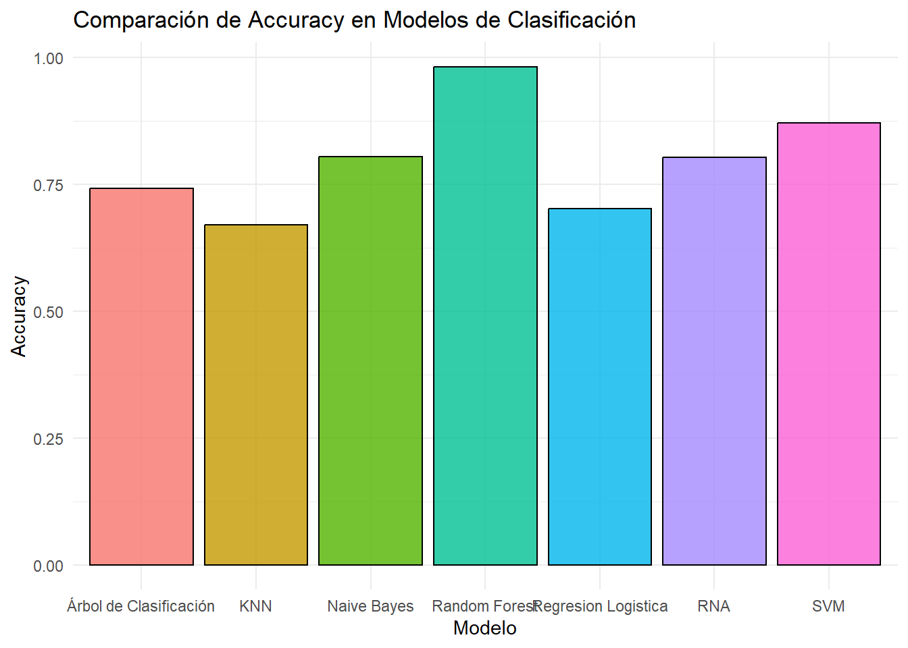
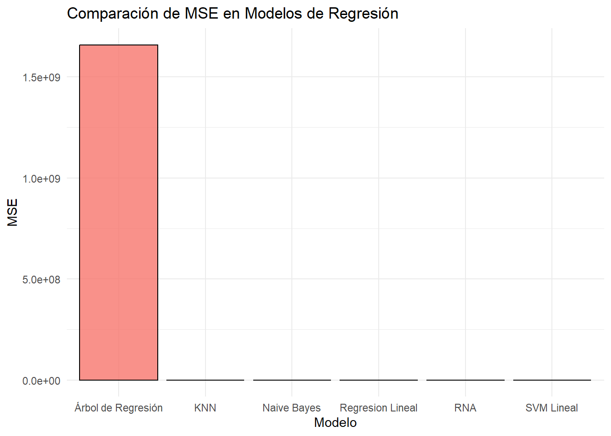

# **House Prices: Advanced Regression Techniques. Un analisis de modelos predictivos para detectar el precio de las casas.**

- **Autores**: *Daniel Barillas Moreno y Mathew Cordero Aquino*
- **Institución / Empresa**: *InmoValor S.A*
- **Fecha**: *6 de Mayo del 2025*

---

---

# Introducción

## Contexto del problema

En el dinámico y competitivo mercado inmobiliario actual, la precisión en la valoración de propiedades se ha convertido en un factor crítico para el éxito de las empresas del sector. InmoValor S.A., consciente de esta realidad, ha decidido dar un paso adelante en su transformación digital mediante la implementación de técnicas avanzadas de análisis de datos y modelos predictivos. El mercado inmobiliario se caracteriza por su complejidad, con múltiples variables interrelacionadas que influyen en el precio final de una propiedad, desde factores intrínsecos como la calidad constructiva o el tamaño, hasta elementos externos como la ubicación o las tendencias socioeconómicas del entorno. Esta complejidad dificulta las valoraciones tradicionales y genera oportunidades para enfoques basados en datos que puedan capturar estas relaciones de manera más objetiva y precisa.

## Justificación

La incorporación de modelos de regresión avanzados para la valoración inmobiliaria responde a diversas necesidades estratégicas de InmoValor S.A.:

1. **Precisión en las valoraciones**: Los métodos tradicionales basados en comparativas de mercado o valoraciones subjetivas presentan un margen de error significativo que puede traducirse en oportunidades perdidas o riesgos financieros.

2. **Agilidad en la toma de decisiones**: La automatización parcial del proceso de valoración permitirá a InmoValor S.A. responder con mayor rapidez a las condiciones cambiantes del mercado y a las necesidades de sus clientes.

3. **Ventaja competitiva**: La utilización de herramientas analíticas avanzadas posicionará a la empresa como un referente tecnológico en el sector inmobiliario, diferenciándola de competidores que mantienen métodos más tradicionales.

4. **Escalabilidad**: Un modelo predictivo robusto permitirá procesar un volumen mayor de propiedades sin comprometer la calidad de las valoraciones, facilitando el crecimiento sostenible de la empresa.

5. **Objetividad**: La implementación de un enfoque basado en datos reduce el componente subjetivo en las valoraciones, ofreciendo resultados más consistentes y defendibles ante clientes e inversores.

## Objetivos generales y específicos

### Objetivo General
Desarrollar e implementar un modelo predictivo de regresión avanzada utilizando el dataset "House Prices: Advanced Regression Techniques" que permita a InmoValor S.A. estimar con precisión el valor de mercado de propiedades inmobiliarias, optimizando así sus procesos de valoración y mejorando su posicionamiento competitivo en el sector.

### Objetivos Específicos

1. **Analizar exhaustivamente** el conjunto de datos disponible para identificar patrones, relaciones y variables determinantes en la formación del precio de las viviendas.

2. **Preparar y transformar** los datos para su óptimo aprovechamiento en la construcción de modelos predictivos, abordando problemas como valores faltantes, outliers y la necesaria codificación de variables categóricas.

3. **Desarrollar y comparar** diferentes modelos de regresión avanzada, evaluando su rendimiento mediante métricas objetivas como RMSE, MAE y R².

4. **Seleccionar e implementar** el modelo predictivo más adecuado en función de su precisión, interpretabilidad y aplicabilidad práctica para el negocio de InmoValor S.A.

5. **Identificar y cuantificar** la importancia relativa de las diferentes características de las propiedades en la determinación de su valor de mercado.

6. **Proporcionar recomendaciones estratégicas** basadas en los hallazgos del análisis para la mejora de los procesos de valoración inmobiliaria de la empresa.

7. **Establecer directrices** para la implementación del modelo en los sistemas operativos de InmoValor S.A., garantizando su correcta integración y uso efectivo por parte del equipo de analistas.

Este proyecto representa una oportunidad única para InmoValor S.A. de transformar su enfoque hacia la valoración inmobiliaria, aprovechando el potencial de los datos y las técnicas avanzadas de análisis para ofrecer un servicio diferencial en un mercado cada vez más competitivo y tecnificado.

---

# Descripción de los Datos
## Fuentes de las variables

Se obtuvieron los datos del sitio web: House Prices - Advanced Regression Techniques, la data de entrenamiento y la data de prueba, ambos extraídos desde la carpeta “house_prices_data/” en data frames llamados train_data (data de entrenamiento) y test_data (data de prueba)

## Descripcion de Variables

De una cantidad de (1460 filas, 81 columnas) se encontraron de todo el dataset de la pagina. Se conoce que

### Variable Objetivo

La variable objetivo es SalePrice, esta variable es el precio de las casas.

Haciendo un analisis de distribucioin de la variable se encontro que

El precio de las casas (SalePrice) no tiene una distribución normal. La mayoría de los precios se concentran en valores bajos y hay algunas casas extremadamente caras que podrían ser outliers.

- SalePrice presenta sesgo positivo (distribución asimétrica a la derecha), lo que indica que hay casas con precios extremadamente altos.

- Posibles valores atípicos en precios muy elevados que podrían afectar el modelo.

- Será útil aplicar una transformación logarítmica para normalizar la distribución.

### Variables del Dataset

| Variable         | Descripción                                                                 |
|------------------|------------------------------------------------------------------------------|
| SalePrice        | Precio de venta de la propiedad (variable objetivo)                         |
| MSSubClass       | Clase del edificio                                                          |
| MSZoning         | Clasificación general de zonificación                                       |
| LotFrontage      | Metros lineales de calle conectados a la propiedad                          |
| LotArea          | Tamaño del terreno en pies cuadrados                                        |
| Street           | Tipo de acceso vial                                                         |
| Alley            | Tipo de acceso por callejón                                                 |
| LotShape         | Forma general del terreno                                                   |
| LandContour      | Nivel de planicie del terreno                                               |
| Utilities        | Tipo de servicios públicos disponibles                                      |
| LotConfig        | Configuración del lote                                                      |
| LandSlope        | Inclinación del terreno                                                     |
| Neighborhood     | Ubicación física dentro de los límites de Ames                              |
| Condition1       | Proximidad a carreteras principales o vías férreas                          |
| Condition2       | Proximidad secundaria a carreteras o vías férreas (si existe)               |
| BldgType         | Tipo de vivienda                                                            |
| HouseStyle       | Estilo de la vivienda                                                       |
| OverallQual      | Calidad general de materiales y acabados                                    |
| OverallCond      | Condición general                                                           |
| YearBuilt        | Año de construcción original                                                |
| YearRemodAdd     | Año de remodelación                                                         |
| RoofStyle        | Tipo de techo                                                               |
| RoofMatl         | Material del techo                                                          |
| Exterior1st      | Revestimiento exterior principal                                             |
| Exterior2nd      | Revestimiento exterior secundario                                            |
| MasVnrType       | Tipo de revestimiento de mampostería                                        |
| MasVnrArea       | Área de revestimiento de mampostería en pies cuadrados                      |
| ExterQual        | Calidad del material exterior                                               |
| ExterCond        | Condición del material exterior                                             |
| Foundation       | Tipo de cimiento                                                            |
| BsmtQual         | Altura del sótano                                                           |
| BsmtCond         | Condición general del sótano                                                |
| BsmtExposure     | Exposición del sótano (nivel jardín/salida)                                |
| BsmtFinType1     | Calidad del área terminada del sótano tipo 1                                |
| BsmtFinSF1       | Metros cuadrados terminados tipo 1 en el sótano                             |
| BsmtFinType2     | Calidad del área terminada del sótano tipo 2                                |
| BsmtFinSF2       | Metros cuadrados terminados tipo 2 en el sótano                             |
| BsmtUnfSF        | Metros cuadrados no terminados del sótano                                   |
| TotalBsmtSF      | Total de metros cuadrados del sótano                                        |
| Heating          | Tipo de calefacción                                                         |
| HeatingQC        | Calidad y condición de la calefacción                                       |
| CentralAir       | Aire acondicionado central (Sí/No)                                          |
| Electrical       | Sistema eléctrico                                                           |
| 1stFlrSF         | Metros cuadrados del primer piso                                            |
| 2ndFlrSF         | Metros cuadrados del segundo piso                                           |
| LowQualFinSF     | Área de baja calidad terminada (todos los pisos)                            |
| GrLivArea        | Área habitable sobre el nivel del suelo                                     |
| BsmtFullBath     | Baños completos en el sótano                                                |
| BsmtHalfBath     | Medios baños en el sótano                                                   |
| FullBath         | Baños completos sobre el nivel del suelo                                    |
| HalfBath         | Medios baños sobre el nivel del suelo                                       |
| Bedroom          | Dormitorios (sin incluir el sótano)                                         |
| Kitchen          | Número de cocinas                                                           |
| KitchenQual      | Calidad de la cocina                                                        |
| TotRmsAbvGrd     | Total de habitaciones sobre el nivel del suelo (sin incluir baños)          |
| Functional       | Funcionalidad de la casa                                                    |
| Fireplaces       | Número de chimeneas                                                         |
| FireplaceQu      | Calidad de las chimeneas                                                    |
| GarageType       | Ubicación del garaje                                                        |
| GarageYrBlt      | Año de construcción del garaje                                              |
| GarageFinish     | Acabado interior del garaje                                                 |
| GarageCars       | Capacidad del garaje (número de autos)                                      |
| GarageArea       | Área del garaje en pies cuadrados                                           |
| GarageQual       | Calidad del garaje                                                          |
| GarageCond       | Condición del garaje                                                        |
| PavedDrive       | Entrada pavimentada                                                         |
| WoodDeckSF       | Área de terraza de madera                                                   |
| OpenPorchSF      | Área de porche abierto                                                      |
| EnclosedPorch    | Área de porche cerrado                                                      |
| 3SsnPorch        | Área de porche de tres estaciones                                           |
| ScreenPorch      | Área de porche con malla                                                    |
| PoolArea         | Área de la piscina                                                          |
| PoolQC           | Calidad de la piscina                                                       |
| Fence            | Calidad de la cerca                                                         |
| MiscFeature      | Característica miscelánea no cubierta por otras categorías                 |
| MiscVal          | Valor en $ de la característica miscelánea                                  |
| MoSold           | Mes de la venta                                                             |
| YrSold           | Año de la venta                                                             |
| SaleType         | Tipo de venta                                                               |
| SaleCondition    | Condición de la venta                                                       |

---

# Análisis Exploratorio

## Variables con Mayor correlacion con la variable Objetivo

Se hizo un analisis de correlacion de las variables con el precio de la casa y dio este resultado

Las variables con mayor correlación positiva con el precio son:

- OverallQual (0.79): Calidad de materiales y acabados.

- GrLivArea (0.70): Área habitable total.

- TotalBsmtSF (0.61): Área del sótano.

- GarageCars (0.64): Cantidad de autos que caben en el garaje.

Esto indicaria de que 

- OverallQual (Calidad de la construcción): Es una de las variables más correlacionadas con SalePrice, lo - que confirma que las casas con mejor calidad de construcción tienen precios más altos.

- GrLivArea (Área habitable sobre el nivel del suelo): También tiene una correlación alta con SalePrice, lo que significa que las casas más grandes suelen costar más.

- TotalBsmtSF (Área total del sótano): Muestra una correlación fuerte con SalePrice, lo que implica que un - sótano más grande puede aumentar el valor de la vivienda.

- GarageCars (Capacidad del garaje en número de autos): Tiene una buena correlación con SalePrice, lo que sugiere que tener más espacio de garaje incrementa el valor de la casa.

## Exploracion de las variables

Se hizo un analisis mas a profundo de las variables a usar en la variable respuesta

- Algunas variables categóricas pueden influir en SalePrice:

- Neighborhood tiene variaciones significativas en los precios.

- Exterior1st y Exterior2nd pueden influir según la calidad de los materiales.

- SaleCondition indica si la venta fue “Normal” o una subasta, lo que puede afectar el precio.

- Solución Propuesta: Convertir variables categóricas a numéricas mediante codificación dummy (One-Hot Encoding).

Tambien se hizo un analisis de los grupos de los precios para las casas y su tamaño que:

- Las casas de calidad alta (OverallQual ≥ 8) tienen un precio significativamente mayor.

- Las casas de calidad media (OverallQual 5-7) forman la mayoría del dataset y muestran mayor variabilidad en los precios.

- Las casas de calidad baja (OverallQual ≤ 4) tienen precios considerablemente menores.

Lugo se realizo un analisis sobre el precio de las casas sobre su calidad

Como podemos ver OverallQual es la variable a predecir SalePrice.

Como ultimo detectamos los valores atipicos

Se observan dos puntos con GrLivArea > 4000 y precios muy bajos

---

## Datos Encontrados
### Ingenieria de Caracteristicas:

#### **Clustering**

Aplicamos un método de clustering automático (K-Means) para descubrir patrones en los datos y segmentar las casas en grupos con características similares.

Los colores indican los diferentes grupos de casas detectados automáticamente.

- Cluster 1 - Casas económicas

Baja calidad de construcción (OverallQual bajo).
Tamaño reducido (GrLivArea y TotalBsmtSF pequeños).
Garaje pequeño o inexistente (GarageCars).
Bajo SalePrice, generalmente en vecindarios más baratos.

- Cluster 2 - Casas de precio medio

Calidad media-alta (OverallQual entre 5 y 7).
Tamaño intermedio, con un área habitable moderada.
Garaje con espacio para 1-2 autos.
Precio en el rango medio del dataset.

- Cluster 3 - Casas de lujo

Alta calidad de construcción (OverallQual > 7).
Casas grandes con mucho espacio (GrLivArea alto).
Garajes amplios (2-3 autos).
SalePrice alto, típicamente en vecindarios premium.

Al final se aplico una agrupacion distinta con clustering

El gráfico de clustering muestra tres grupos diferenciados en el dataset de precios de casas. Basándonos en la distribución y separación de los clusters, se pueden hacer las siguientes observaciones:

- Este grupo representa casas con menor calidad de construcción (OverallQual baja), menor área habitable (GrLivArea pequeña) y sótanos más pequeños.

- Muchas de estas casas tienen valores atípicos y precios significativamente más bajos en comparación con el resto del dataset.

- Posible ubicación en vecindarios menos costosos.

- Cluster 2 (Azul - Centro): Casas de Precio Medio y Tamaño Promedio

#### **PCA**

Se aplico PCA sobre las variables y se encontro que 

Podemos ver que en el grafico despues de los primeros 15 PCA se estabiliza el codo. Estos primeros 14 PCA pertenecen al 63% de la descripcion de los datos. Asi que despues de hacer el analisis podemos notar que la regla del Kaiser si aplico de manera correcta

### Variables Finales

Al final las variables que se utilizaron despues de realizar el analisis de PCA y Clustering, son:

- OverallQual 
- GrLivArea 
- GarageCars 
- TotalBsmtSF 
- YearBuilt

---

# Modelos para detectar SalePrice

## Modelos de Clasificacion

Acontinuacion se muestra una lista del rendimiento de los modelos de clasificacion. Se uso accurancy , mientras mas accurrancy mejor rendimiento del modelo

Podemos ver que de todos los modelos RNA en realidad es solo mejor que el Arbol de Desicion, la Regresion Logistica y KNN porque para SVM no es tan bueno y con Random Forest pero con Naive Bayes tienen el mismo rendimiento

En conclusion es muy bueno en tiempo de repidez de SVM y de hecho si tienen casi el mismo rendimiento seria mejor usarlo en lugar de ese y Naive Bayes . Pero flaquece con respecto al random forest , aunque el problema del random forest es su tiempo de ejecucion, un problema tambien que tiene es que nuestro modelo su complejidad en espacio es mucho mayor que todos los demas por lo que no se recomienda usar en grandes cantidades de datos sin apoyo de equipo necesario

## Modelos de Regresion

Podemos ver que el rendimiento para predecir el valor de la casa usando modelos de regresion es el siguiente. Ojo mientras menor sea el MSE mejor el modelo

De todos el pero es el de Arbol de regresion. Y no podemos comparar el RNA con el de regresion lineal , knn o naive bayes porque es peor que esos.

El unico en que puede haber una comparacion clara es con SVM lineal, que de hecho es peor que ese. Lo que indica que nuestro RNA no es tan bueno al momento de realizar regresiones. Pero el lado positivo es que podemos cambiar la funcion y esto mismo puede ayudar a que mejore un poco.

En conclusion para poder realizar una regresion no es tan bueno el RNA a menos que sean datos mas complejos que una simple regresion lineal , y existan una gran cantidad de variables que podemos usar.

## Modelo Final

Podemos ver un resumen siendo el siguiente

| Nombre del Modelo    | Clasificacion (Accurancy) | Regresion (MSE) | Observaciones                       |
|----------------------|---------------------------|-----------------|-------------------------------------|
| Regresion Lineal     | No Aplica                 | 9.157e-18       | El tiempo de ejecucion mas rapido   |
| Regresion Logistica  | 0.7013                    | No aplico       | Es el que menos tiempo toma de clas |    
| KNN                  | 0.67                      | 0.1600          | __________________________________  |
| Naive Bayes          | 0.8041237                 | 0.0504431       | __________________________________  |
| Arboles de Desicion  | 0.7414188                 | 1658823049      | Es el que peor le va en regresion   |
| Random Forest        | 0.9816934                 | No aplico       | Toma mas tiempo de ejecucion        |  
| SVM                  | 0.8707                    | 133.76          | ____________________________        |   
| RNA                  | 0.8025                    | 174             | Es el que mas espacio toma de todos |

El mejor modelo para predecir una variable continua es regresion lineal, esto porque es el que de todos toma menos tiempo, tiene mas ajuste de R^2. El unico problema es que si se tienen una gran cantidad de variables categoricas y se quiere usar con one encode no rinde tan bien.

El siguiente mejor modelo para clasificacion es SVM, Esto porque aunque se tarda mucho en tiempo de ejecucion no es tanto a comparacion de Random Forest.

Ademas esta muy bien ajustado sin sobreajuste ni subajuste. Y es el que mejor llega a predecir la variable. Solo en caso que no sea tan bueno en clasificar se recomienda random forest pero este ultimo tambien crece mucho en tiempo.

Pero si tomamos en consideracion un modelo que sirve para ambos casos seria el de **Naive Bayes**. Ya que es el que rinde en promedio en ambos . Es mucho mejor que SVM en clasificacion y mucho mejor que KNN en regresion. Por lo que seria un modelo definitivo para ambo usos.

En conclusion, el mejor modelo de todos es **Naive Bayes**, pero si solo se quiere usar exclusivamente para clasificacion lo mejor seria usar SVM, y si solo se quiere usar para Regresion optar por regresion lineal.

---

## Conclusiones

- El precio de las casas *SalesPrice* se puede dividir en 3 grupos donde el precio es *bajo*,  *media* *alto*.

- El precio de las casas se puede clasificar y predecir mediante el uso de **Naive Bayes**

- El precio de las casas tiene una alta correlacion con las variables de **OverallQual:** (Calidad de materiales y acabados.), **GrLivArea:** (Área habitable total.), **TotalBsmtSF:** (Área del sótano.), **GarageCars:** (Cantidad de autos que caben en el garaje.).

---

